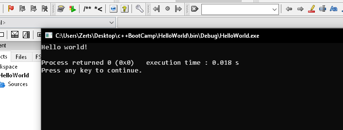

<h2 align="center">
  C++ - v.1 
  <a href="https://z18r.github.io/Cardoza_Joezer_E_Portfolio_2021_Updated_December/" target="_blank">Cardoza, Joezer E</a>
</h2>

  

 

So making c++  just add cout << "Hello World" << endl;  
return 0;

### Show your support

Give a ⭐ if you like this website!

